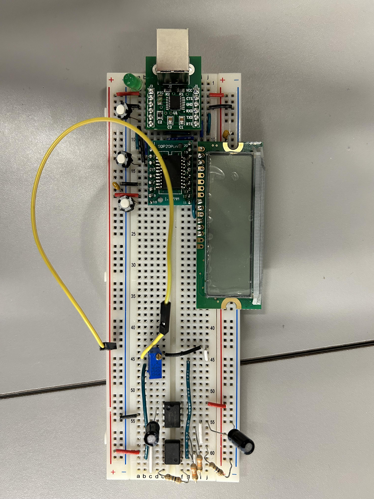
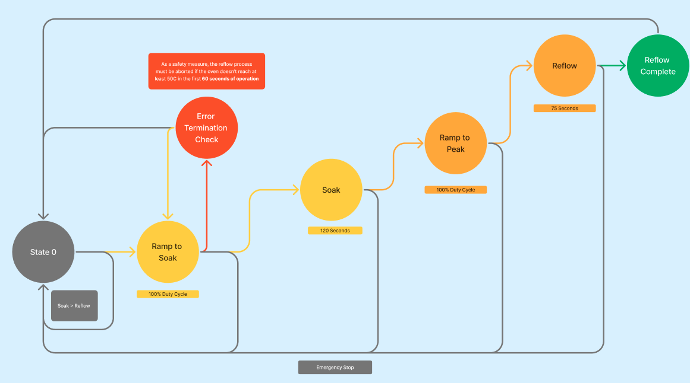
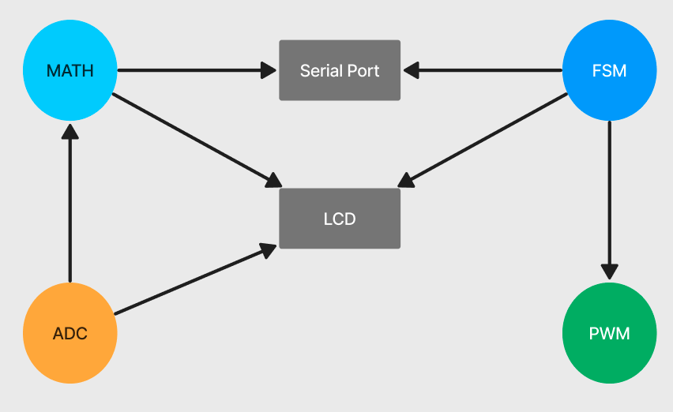
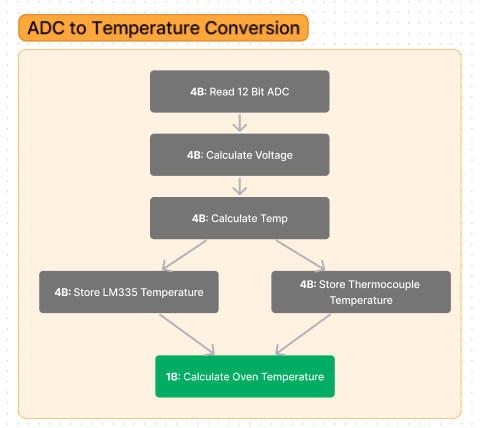
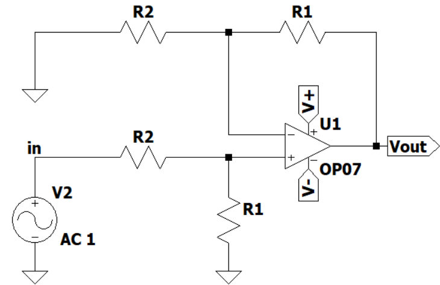

# Reflow Oven Controller

## Contents

* [Overview](#Overview)
* [System Architecture](#System-Architecture)
* [Firmware](#Firmware)
    * [Modules](#Modules)
        * [ADC](#ADC)
    * [Compile & Flash](#Compile-&-Flash)
* [Data Processing](#Data-Processing)
    * [GCP Bucket](#GCP-Bucket)
* [Demonstration](#Demonstration)
* [Credit](#Credit)

## Overview

We built and programmed a controller to apply the reflow soldering process for assembling **EFM8** boards with ovens in the UBC ECE Undergraduate Lab.

### Hardware

This was built with a **N76E003** microcontroller, **ADC** input peripherals and an **op-amp** circuit to amplify voltage measurements from a thermocouple.

## System Architecture

This electronic circuit and its firmware was designed to achieve the state operations in the following [Architecture Diagram](https://www.figma.com/file/KlvMFzEIvtYgwix3Td906g/ELEC-291-%3A-Project-1%2C-Software-Block-Diagram?type=whiteboard&node-id=0-1&t=hhKl1g4AJu5PXBLr-0).

    

We implemented a statemachine to go through each mandatory condition statement and state for the reflow soldering process to execute to completion in a safe manner. There was emphasis on meeting the necessary preconditions for the circuit to enable the subsequent stage.

## Firmware

This was implemented in **8051 ASM**. We structured the [`Firmware`](Firmware) codebase to have peripheral functionality in dedicated `.inc` files. The **Finite State Machine (FSM)** controller was implemented in the `MAIN.ASM` and included these libraries to undergo the reflow process.

### Modules

A large part of the system design involved interaction between different firmware modules and the **I/O** devices, as shown in this diagram.

    

#### ADC

The **ADC** firmware was a problem of its own. This was a several-step task, as shown in the diagram below.

    

The room temperature was read with a **LML335** temperature sensor, which was straightforward to implement. For the thermocouple temperature, we built a dedicated **op-amp** circuit to amplify the voltage.

    

Through firmware, we performed arithmetic on the voltage read to account for the amplification and convert it into a temperature value.

The controller functionality relied on an accurate calculation of this to be summed with the room temperature and was required to be within *3C* accuracy. We validated this extensively, using the [`Multimeter_Temp.pyw`](Firmware/Multimeter_Temp.pyw) application.

https://github.com/user-attachments/assets/6e5ac46c-fdab-4dab-93d4-04a25c11d7c0

### Compile & Flash

The build tasks in the [`.vscode`](Firmware/.vscode/tasks.json) file were set up to run :
* the `a51.exe` executable to compile the [`MAIN.ASM`](Firmware/MAIN.ASM) file
* the `ISPN76E003.exe` executable to flash the program onto the **N76E003** (**8051** family) microcontroller

## Data Processing

To augment the user-feedback, we developed the **Python** application run with [`app.py`](Data_Processing/app.py). This was used to display the real-time incoming datastream, store it to a **pandas** table, and export it to a `.csv` for postprocessing in the [`Logbook`](Data_Processing/Logbook) subdirectory. The software backend and user interface was designed to receive serial transmission during state changes and indicate this to the user as well.

### GCP Bucket

We set up a **Google Cloud Platform (GCP)** bucket for additional data post-processing, across multiple reflow processes. This enabled us to leverage a data warehouse and its Big Data handling capabilities if we needed the infrastructure to analyze our controller performance over many runs. The generated reflow process `.csv` was uploaded to the **GCP** bucket with the [`uploading.py`](Data_Processing/uploading.py) package in the base application.

We also implemented the ability to download these with the [`downloading.py`](Data_Processing/downloading.py) script.

## Demonstration

We have uploaded our Final Demo on <a href="https://www.youtube.com/watch?v=Bzm737dduOw" target="_blank">Youtube</a>.

We have also attached our [Project Report](/Report/ELEC291_TeamA9_ReflowOvenController.pdf) for detailed analysis of our engineered solution.

## Credit

This was completed as part of the <b>ELEC 291 - Design Studio</b> project course in the <b>The University of British Columbia Electrical and Computer Engineering</b> undergraduate program. We received tremendous support and guidance from Dr. Jesus Calvino-Fraga.
